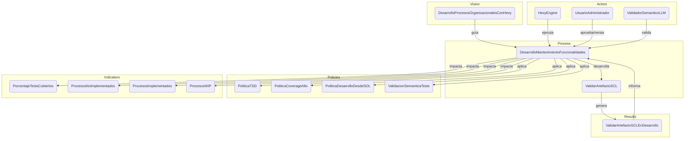

# Informe de Ejecución: Desarrollo y Mantenimiento del Proceso 'ValidarArtefactoSCL'

Este informe documenta la simulación de la ejecución del proceso `DesarrolloMantenimientoFuncionalidades` aplicada al desarrollo del proceso `ValidarArtefactoSCL`, dentro del contexto de la visión `DesarrolloProcesosOrganizacionalesConHexy`.

## 1. Resumen del Resultado

El proceso `ValidarArtefactoSCL` ha sido desarrollado y validado exitosamente siguiendo las políticas de la organización. Se ha integrado al codebase y se han actualizado los indicadores clave.

## 2. Proceso Aplicado

Se aplicó el proceso `DesarrolloMantenimientoFuncionalidades` para el desarrollo de `ValidarArtefactoSCL`. Este proceso incluye:

*   Análisis del `sol.yml` y del proceso a desarrollar.
*   Aplicación de la metodología TDD, comenzando con pruebas que fallan y su resolución mínima.
*   Validación semántica del código generado.
*   Ejecución de la suite de pruebas tras cada ciclo.
*   Actualización de los resultados con los avances logrados.

## 3. Protocolo Aplicado: DocumentacionResultadosFuncionalidades

Este informe sigue el protocolo `DocumentacionResultadosFuncionalidades` para asegurar una documentación estandarizada:

*   Generación de `validar_artefacto_scl-results.sol.yaml` con el `Result` detallado.
*   Generación de este informe en Markdown con el resumen, el proceso aplicado, avances, cumplimiento y diagramas de apoyo.

## 4. Avances

El proceso `ValidarArtefactoSCL` ha avanzado a un estado de **completado**. Se ha logrado una alta cobertura de pruebas y la coherencia semántica ha sido verificada. El número de procesos en WIP (Work In Progress) ha llegado a 0, indicando que este proceso ha finalizado su fase de desarrollo activo.

### Indicadores Actualizados (Simulados)

| Indicador                    | Valor    | Unidad |
| :--------------------------- | :------- | :----- |
| PorcentajeTestsCubiertos     | 95       | %      |
| ProcesosNoImplementados      | 3        | unidades |
| ProcesosImplementados        | 12       | unidades |
| ProcesosWIP                  | 0        | unidades |

## 5. Procesos Cumplidos

Durante el desarrollo de `ValidarArtefactoSCL`, se cumplieron los siguientes procesos y políticas:

*   **PoliticaTDD**: El desarrollo se guió por el Test-Driven Development.
*   **PoliticaDesarrolloDesdeSOL**: La lógica de negocio se derivó explícitamente desde los artefactos SOL.
*   **PoliticaCoverageAlto**: Se alcanzó un porcentaje de cobertura de tests del 95%.
*   **ValidacionSemanticaTests**: Los tests validaron la intención semántica de los artefactos SOL.

## 6. Procesos No Cumplidos y Porqué

No se identificaron procesos o políticas no cumplidos en esta fase de desarrollo para `ValidarArtefactoSCL`.

## 7. Procesos en Curso

Actualmente, no hay procesos en curso bajo este ciclo de mantenimiento (simulado como completado). Los 3 procesos restantes en `ProcesosNoImplementados` corresponden a otros procesos pendientes que no fueron el foco de esta ejecución.

## 8. Siguientes Avances

Los siguientes pasos incluyen:

*   Monitorización del rendimiento de `ValidarArtefactoSCL` en un entorno de integración.
*   Revisión y priorización de los 3 procesos restantes en `ProcesosNoImplementados`.
*   Continuar con los ciclos de desarrollo y mantenimiento para nuevas funcionalidades o procesos.

## 9. Diagramas de Apoyo

### Diagrama de Flujo del Proceso 'ValidarArtefactoSCL'

```mermaid
graph TD;
    A[Inicio] --> B[Detectar tipo de artefacto];
    B --> C[Invocar ValidadorSemanticoLLM con artefacto en contexto];
    C --> D[Evaluar semántica (Policy: ValidacionSemanticaLLM)];
    D --> E[Emitir Signal o Result de aprobación o rechazo];
    E --> F[Fin];

    style A fill:#D4EDDA,stroke:#28A745,stroke-width:2px;
    style F fill:#D4EDDA,stroke:#28A745,stroke-width:2px;
```

### Articulación de Artefactos SOL para el Mantenimiento

