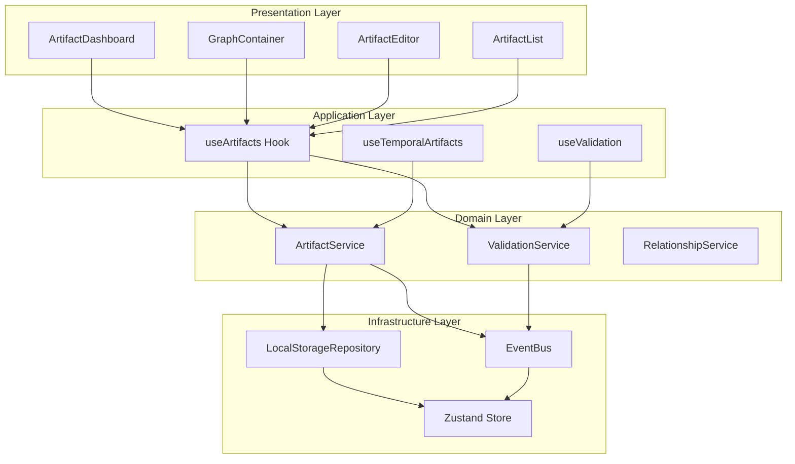

# Artifacts Module Integration - Design Document

## Overview

This design document outlines the strategy for creating a completely new artifacts module that replaces the existing artifact management components. Since there are no current users, we can break and recreate the system to implement a clean, semantically-driven artifact management system that follows Hexy Framework principles and DDD patterns from the ground up.

## Architecture

### Clean Slate Approach

Since there are no current users, we will completely replace the existing artifact management system with a new, semantically-driven module that follows Hexy Framework principles from the ground up.

#### Components to Replace
- **GraphContainer.tsx** → New semantic graph with enhanced D3.js visualization
- **artifactStore.ts** → New service-based state management with DDD patterns
- **ArtifactEditor.tsx** → New semantic artifact editor with comprehensive validation
- **Types/Artifact.ts** → New comprehensive type system with Zod schemas

#### New Module Architecture



## Components and Interfaces

### 1. New Artifacts Module Structure

#### Core Service Layer
```typescript
interface ArtifactService {
  // Complete artifact lifecycle management
  createArtifact(payload: CreateArtifactPayload): Promise<Artifact>
  updateArtifact(id: string, updates: UpdateArtifactPayload): Promise<Artifact>
  deleteArtifact(id: string): Promise<boolean>
  getArtifact(id: string): Promise<Artifact | null>
  searchArtifacts(query: ArtifactSearchQuery): Promise<Artifact[]>
  validateArtifact(artifact: Artifact): Promise<ValidationResult>
}
```

#### Semantic Validation Service
```typescript
interface ValidationService {
  // Hexy semantic validation
  validateSemanticCoherence(artifact: Artifact): ValidationResult
  validatePurposeAlignment(purpose: string, context: Record<string, unknown>): ValidationResult
  validateAuthorityLegitimacy(authority: string, type: ArtifactType): ValidationResult
  validateEvaluationCriteria(criteria: string[], purpose: string): ValidationResult
  validateRelationshipSemantics(relationship: Relationship): ValidationResult
}
```

### 2. New Component Architecture

#### Semantic Graph Container
```typescript
interface SemanticGraphContainer {
  // Clean D3.js implementation with semantic awareness
  artifacts: Artifact[]
  relationships: Relationship[]
  temporalArtifacts: TemporalArtifact[]
  
  // Semantic interactions
  onSemanticArtifactCreate(position: Coordinates, type: ArtifactType): Promise<Artifact>
  onSemanticRelationshipCreate(source: Artifact, target: Artifact, type: RelationshipType): Promise<Relationship>
  onArtifactValidation(artifact: Artifact): Promise<ValidationResult>
  
  // Visual semantic feedback
  renderSemanticValidationState(artifact: Artifact): VisualState
  renderRelationshipStrength(relationship: Relationship): VisualProperties
}
```

#### Semantic Artifact Editor
```typescript
interface SemanticArtifactEditor {
  // Complete semantic editing interface
  artifact?: Artifact
  validationService: ValidationService
  
  // Semantic field validation
  onPurposeChange(purpose: string): Promise<ValidationResult>
  onContextChange(context: Record<string, unknown>): Promise<ValidationResult>
  onAuthorityChange(authority: string): Promise<ValidationResult>
  onEvaluationCriteriaChange(criteria: string[]): Promise<ValidationResult>
  
  // Real-time semantic guidance
  providePurposeGuidance(type: ArtifactType): string[]
  provideContextSuggestions(purpose: string): Record<string, unknown>
  provideAuthorityOptions(type: ArtifactType): string[]
}
```

### 3. New Type System

#### Complete Semantic Type System
```typescript
// Use the comprehensive module types directly
import {
  Artifact,
  TemporalArtifact,
  Relationship,
  ArtifactType,
  RelationshipType,
  ARTIFACT_TYPES,
  RELATIONSHIP_TYPES,
  artifactSchema,
  temporalArtifactSchema
} from './modules/artifact-module/types/artifact.types'

// No migration needed - clean implementation
interface NewArtifactSystem {
  useSemanticTypes(): typeof ARTIFACT_TYPES
  useValidationSchemas(): { artifactSchema, temporalArtifactSchema }
  useTypeConfigurations(): Record<ArtifactType, ArtifactTypeConfig>
}
```

## Data Models

### 1. Pure Semantic Artifact Model

```typescript
// Use the complete module artifact model directly
interface SemanticArtifact extends Artifact {
  // D3.js visualization properties (added to base model)
  visualProperties: {
    x: number
    y: number
    vx?: number   // D3.js velocity
    vy?: number   // D3.js velocity
    fx?: number   // D3.js fixed position
    fy?: number   // D3.js fixed position
    scale: number
    opacity: number
  }
  
  // Enhanced semantic metadata
  semanticTags: string[]
  businessValue: number
  stakeholders: string[]
  dependencies: string[]
  semanticWeight: number
}
```

### 2. Enhanced Temporal Artifact

```typescript
interface SemanticTemporalArtifact extends TemporalArtifact {
  // Enhanced validation state tracking
  validationProgress: {
    name: ValidationState
    type: ValidationState
    description: ValidationState
    purpose: ValidationState
    context: ValidationState
    authority: ValidationState
    evaluation: ValidationState
  }
  
  // Visual state for graph rendering
  visualState: {
    opacity: number
    scale: number
    color: string
    pulseAnimation: boolean
  }
  
  // Semantic guidance state
  guidanceState: {
    showPurposeHelp: boolean
    showContextHelp: boolean
    showAuthorityHelp: boolean
    showEvaluationHelp: boolean
  }
}
```

### 3. Enhanced Semantic Relationships

```typescript
interface SemanticRelationship extends Relationship {
  // Visual properties for graph rendering
  visualProperties: {
    strokeWidth: number
    strokeColor: string
    strokeDashArray?: string
    opacity: number
    animated: boolean
  }
  
  // Semantic strength and validation
  semanticStrength: number
  businessImpact: 'high' | 'medium' | 'low'
  validationStatus: 'valid' | 'warning' | 'error'
  
  // Contextual information
  contextualRelevance: number
  temporalRelevance: number
  stakeholderImpact: string[]
}
```

## Error Handling

### 1. Semantic Validation Error Handling

```typescript
interface SemanticValidationErrorHandler {
  handleSemanticValidationError(error: SemanticError): void
  handleBusinessRuleViolation(error: BusinessRuleError): void
  handleRelationshipValidationError(error: RelationshipError): void
  
  // User feedback and guidance
  provideSemanticGuidance(error: SemanticError): string
  suggestCorrections(error: ValidationError): Suggestion[]
  explainBusinessRules(context: string): string
  providePurposeGuidance(type: ArtifactType): string[]
}
```

### 2. Service Layer Error Handling

```typescript
interface ServiceErrorHandler {
  handleServiceOperationError(error: ServiceError): void
  handleValidationServiceError(error: ValidationError): void
  handleRepositoryError(error: RepositoryError): void
  
  // Recovery mechanisms
  retryOperation(operation: () => Promise<any>): Promise<any>
  fallbackToOfflineMode(): void
  validateDataIntegrity(): Promise<boolean>
}
```

### 3. Graph Visualization Error Handling

```typescript
interface GraphErrorHandler {
  handleD3RenderingError(error: D3Error): void
  handleNodeCreationError(error: NodeError): void
  handleRelationshipRenderingError(error: RelationshipError): void
  
  // Visual feedback
  showErrorState(artifact: Artifact, error: Error): void
  recoverFromRenderingError(): void
  optimizePerformance(): void
}
```

## Testing Strategy

### 1. New Module Testing Approach

#### Service Layer Tests
```typescript
describe('New ArtifactService', () => {
  test('should create artifacts with semantic validation')
  test('should handle temporal artifact lifecycle')
  test('should manage relationships semantically')
  test('should provide comprehensive validation feedback')
  test('should integrate with event bus properly')
})
```

#### Component Testing
```typescript
describe('New Semantic Components', () => {
  test('should render semantic graph with D3.js')
  test('should provide real-time validation feedback')
  test('should handle artifact creation workflow')
  test('should manage temporal artifacts visually')
  test('should create semantic relationships')
})
```

### 2. Semantic Validation Testing

#### Business Rule Tests
```typescript
describe('Semantic Validation', () => {
  test('should validate purpose-context alignment')
  test('should validate authority legitimacy')
  test('should validate evaluation criteria coherence')
  test('should validate relationship semantics')
  test('should provide meaningful guidance')
})
```

#### Type System Tests
```typescript
describe('Type System', () => {
  test('should validate all artifact types correctly')
  test('should enforce Zod schemas properly')
  test('should handle type-specific validation rules')
  test('should provide type-specific configurations')
})
```

### 3. Performance Testing

#### Load Testing
```typescript
describe('Performance', () => {
  test('should handle 1000+ artifacts efficiently')
  test('should render graph with optimal performance')
  test('should manage memory usage effectively')
  test('should provide responsive user interactions')
  test('should handle concurrent operations')
})
```

## Implementation Phases

### Phase 1: New Module Foundation (Week 1)
1. **Create New Artifacts Module**
   - Set up new module structure following template
   - Implement ArtifactService with LocalStorageRepository
   - Create ValidationService with semantic rules
   - Set up event bus integration

2. **New Type System Implementation**
   - Use comprehensive artifact.types.ts from module
   - Implement Zod validation schemas
   - Create type configurations for all artifact types
   - Set up semantic relationship types

### Phase 2: Core Components Creation (Week 2)
1. **New Semantic Graph Container**
   - Create clean D3.js implementation
   - Implement semantic artifact visualization
   - Add temporal artifact support with visual feedback
   - Create relationship rendering system

2. **New Semantic Artifact Editor**
   - Build comprehensive editing interface
   - Implement real-time semantic validation
   - Add purpose-context-authority-evaluation fields
   - Create semantic guidance system

### Phase 3: Advanced Semantic Features (Week 3)
1. **Semantic Validation System**
   - Implement business rule validation
   - Add purpose-context alignment checks
   - Create authority legitimacy validation
   - Build evaluation criteria coherence checks

2. **Relationship Management**
   - Create semantic relationship creation
   - Implement relationship validation
   - Add visual relationship strength indicators
   - Build relationship type management

### Phase 4: Integration and Optimization (Week 4)
1. **Dashboard Integration**
   - Replace existing components with new module
   - Update App.tsx to use new ArtifactDashboard
   - Remove old artifact management code
   - Test complete workflow

2. **Testing and Documentation**
   - Comprehensive test suite for new module
   - Performance optimization and testing
   - Complete API documentation
   - Usage guides and examples

## Performance Considerations

### 1. Memory Management
- Implement artifact pooling for large datasets
- Optimize D3.js node rendering
- Manage temporal artifact lifecycle efficiently

### 2. Rendering Optimization
- Use React.memo for expensive components
- Implement virtual scrolling for large lists
- Optimize graph rendering with canvas fallback

### 3. Data Synchronization
- Implement debounced store updates
- Use efficient diff algorithms for change detection
- Optimize event bus performance

## Security Considerations

### 1. Data Validation
- Sanitize all user inputs
- Validate artifact relationships
- Prevent XSS in artifact descriptions

### 2. Access Control
- Implement artifact-level permissions
- Validate relationship creation rights
- Secure export/import operations

### 3. Data Integrity
- Implement transaction-like operations
- Validate data consistency
- Provide rollback mechanisms

This design provides a comprehensive approach to integrating the artifacts module while maintaining existing functionality and following Hexy Framework semantic principles.