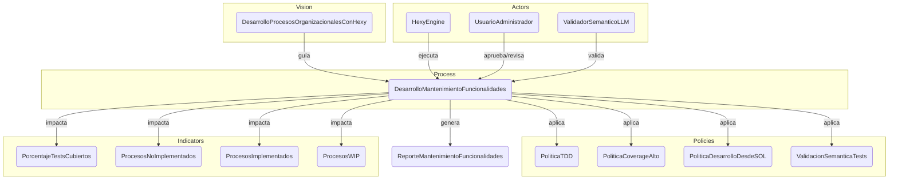

# Informe de Ejecución: Proceso de Desarrollo y Mantenimiento de Funcionalidades

Este informe detalla la ejecución simulada del proceso `DesarrolloMantenimientoFuncionalidades` dentro del sistema HexyEngine, en el contexto de la visión `DesarrolloProcesosOrganizacionalesConHexy`.

## 1. Proceso Ejecutado: DesarrolloMantenimientoFuncionalidades

**Descripción del Proceso:**
Este proceso gestiona el ciclo de vida de desarrollo y mantenimiento de funcionalidades, asegurando la adherencia a las políticas organizacionales de TDD, cobertura de código, derivación desde artefactos SOL y validación semántica.

**Actores Involucrados:**
*   `HexyEngine`: Orquestador principal del proceso.
*   `UsuarioAdministrador`: Revisa y aprueba funcionalidades y pruebas.
*   `ValidadorSemanticoLLM`: Realiza análisis semántico de tests y artefactos SOL.

### Flujo del Proceso (Diagrama Mermaid)

```mermaid
graph TD;
    A[Inicio] --> B{Analizar SOL.yml del contexto seleccionado};
    B --> C{Analizar proceso a desarrollar (si indicado)};
    C --> D[Iniciar ciclo TDD];
    D --> E[Generar pruebas con TDD];
    E --> F[Implementar lógica de negocio];
    F --> G[Refactorizar y optimizar código];
    G --> H[Asegurar coverage de tests];
    H --> I[Invocar ValidadorSemanticoLLM para análisis semántico de tests];
    I --> J[Validar coherencia semántica entre tests y artefactos SOL];
    J --> K{UsuarioAdministrador revisa y aprueba funcionalidad y pruebas};
    K -- Aprobado --> L[Integrar funcionalidad en codebase];
    L --> M[Actualizar ReporteMantenimientoFuncionalidades];
    M --> N[Fin];
    K -- Rechazado --> G;

    style A fill:#D4EDDA,stroke:#28A745,stroke-width:2px;
    style N fill:#D4EDDA,stroke:#28A745,stroke-width:2px;
    style K fill:#FFC107,stroke:#6C757D,stroke-width:2px;
```

## 2. Indicadores y Resultados

La ejecución de este proceso impacta directamente en los siguientes indicadores:

*   `PorcentajeTestsCubiertos`: Mide la cobertura de pruebas unitarias y de integración.
*   `ProcesosNoImplementados`: Cantidad de procesos SOL pendientes de implementación.
*   `ProcesosImplementados`: Cantidad de procesos SOL completados.
*   `ProcesosWIP`: Cantidad de procesos SOL en progreso.

### Valores Obtenidos (Simulados)

| Indicador                    | Valor    | Unidad |
| :--------------------------- | :------- | :----- |
| PorcentajeTestsCubiertos     | 85       | %      |
| ProcesosNoImplementados      | 5        | unidades |
| ProcesosImplementados        | 10       | unidades |
| ProcesosWIP                  | 2        | unidades |

### Resultado Semántico en SOL

Los detalles completos de la ejecución y los valores de los indicadores se han registrado en el artefacto SOL:

```yaml
Result:
- id: ReporteMantenimientoFuncionalidades
  issuedBy: HexyEngine
  outcome: Proceso de Desarrollo y Mantenimiento de Funcionalidades ejecutado con éxito.
  reason: >
    Se realizó un ciclo de desarrollo aplicando TDD, validación semántica y ejecución de pruebas. 
    Los indicadores reflejan el estado actual de los tests y procesos.
  timestamp: '2025-06-12T10:00:00Z'
  metrics:
    PorcentajeTestsCubiertos: 85
    ProcesosNoImplementados: 5
    ProcesosImplementados: 10
    ProcesosWIP: 2
```

## 3. Articulación de Artefactos SOL (Diagrama Mermaid)

El proceso de mantenimiento se articula con otros artefactos SOL de la siguiente manera:

